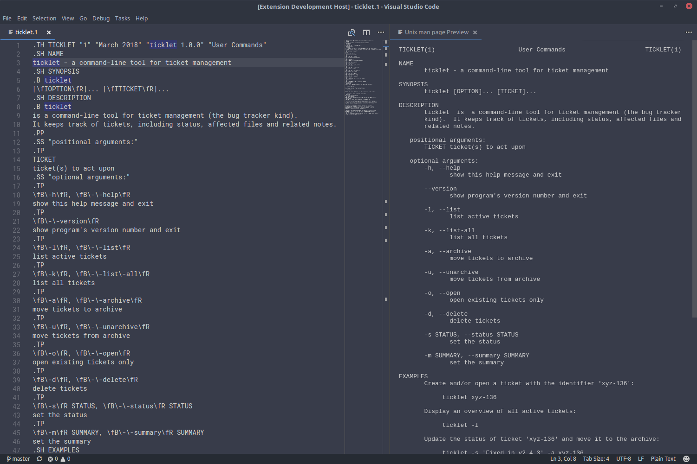

# Visual Studio Code - Unix `man` page preview

Displays a live preview of Unix `man` pages.

This extension adds the ability to preview `man` page files in a way similar to
the live preview of Markdown files.

## Features

The extension adds a "Show Unix man page Preview" command, which displays a
live preview of the `man` page that is currently being edited.

## Requirements

The extension relies on the availability of the `man` and `cat` commands. Those
two programs must thus be available on your `$PATH` for it to work. Given their
prevalence on Unix-like systems, that normally shouldn't be an issue.
